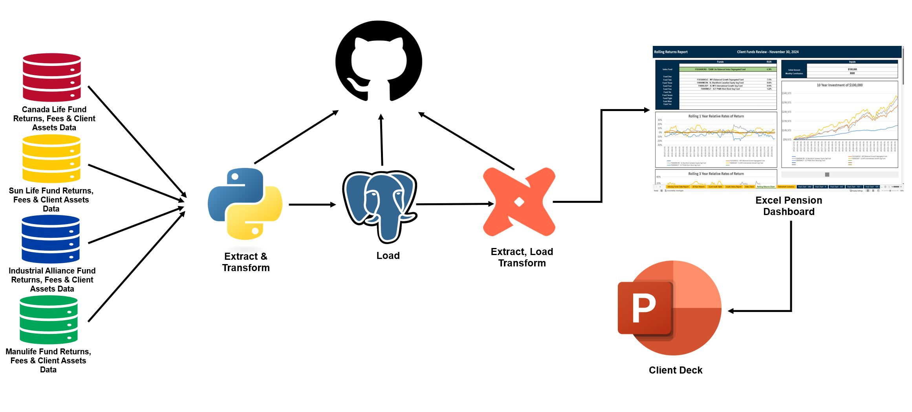

# **Pension Division Data Modernization and Automation**  

## **Overview**  
The goal of this project was to update and enhance the pension division's dashboard and data ecosystem to improve **data quality, storage, reproducibility, and scalability**. This involved **optimizing data workflows, refining reporting capabilities, and integrating advanced analytics** to support better decision-making. Additionally, enhancements were made to **functionality and efficiency**, creating a more user-friendly experience and improving operational productivity.  

---

## **Table of Contents**  
- [Project Background](#project-background)  
- [Data Structure & Initial Checks](#data-structure--initial-checks)  
- [Project Workflow](#project-workflow)  
- [Implementation](#implementation)  
- [Dashboards](#dashboards)  

---

## **Project Background**  
The modernization of the pension division’s dashboard and data ecosystem was necessary due to the limitations of the existing **Excel-based workflow**. Previously, all data processing—including **cleaning, validation, and analysis**—was performed manually in Excel, with no **centralized database, ETL/ELT pipeline, or automated data quality checks**. This approach led to **inefficiencies, inconsistencies, and scalability challenges**.  

By modernizing the system, we introduced:  
✅ **Structured data storage**  
✅ **Automated data processing**  
✅ **Validation mechanisms**  

This transformation significantly **improved data accuracy, reproducibility, and operational efficiency**, while enabling **better decision-making and scalability**.  

---

## **Data Structure & Initial Checks**  

- **Database Documentation, Lineage Graph, Data Quality Checks, and SQL Queries:** [View Here](https://nhl-db-team-season-stats.netlify.app/#!/overview)  
- **ETL Pipeline:** [View Here](/Code/ETL/)  
- **ELT Pipeline:** [View Here](/Code/ELT/Funds_Data/)  

---

## **Project Workflow**  

  

---

## **Implementation**  

### **ETL Process: Data Extraction, Transformation, and Loading**  
- Developed an **ETL process** to extract data from insurance company CSV files using **Python**.  
- Cleaned and transformed the data to ensure **consistency and accuracy**.  
- Loaded fund and returns data into the newly created **fund_review_db** SQL database.  

### **ELT Pipeline with dbt for Enhanced Data Transformation**  
- Implemented an **ELT pipeline** using **dbt (Data Build Tool)** to build structured tables for analysis, including:  
  - **Compounded returns data**  
  - **Rolling returns data**  
  - **Other key financial metrics** to enhance data-driven decision-making.  
- dbt also enabled **automated data quality checks**, ensuring accuracy before data was imported into the Excel dashboard.  

### **Centralized Data Management and Improved Visibility**  
- Established a **single, centralized source of truth** for fund and returns data, replacing the previous system where **a separate dashboard was created for each client**.  
- This eliminated **discrepancies and confusion**, improving **transparency and consistency** in reporting.  
- By automating data processing, **analysis time was reduced from days to minutes**, allowing financial analysts to **focus on strategic decision-making rather than manual data handling**.  

### **Automation and Documentation Enhancements**  
- Automated the entire **data workflow**, significantly reducing **manual intervention and errors**.  
- Leveraged **dbt’s documentation features** to generate:  
  - **Comprehensive definitions** of key data elements.  
  - **SQL queries** used for transformations.  
  - **Lineage graphs** to visualize relationships between tables, improving **data governance and traceability**.  

---

## **Key Benefits**  
- **Automated and scalable** data pipeline, reducing manual work and errors.  
- **Improved data quality and consistency** through automated checks and validation.  
- **Enhanced analytics and insights** with structured tables for better financial analysis.  
- **Single source of truth**, ensuring clarity and accuracy in reporting.  
- **Comprehensive documentation** for better data governance and future scalability.  

This transformation has significantly improved **operational efficiency**, allowing for a more **streamlined, accurate, and scalable** approach to data management within the pension division.  

---

## **Dashboards**  

The dashboards can be accessed here: [View Dashboard](/BI/Version%20-%205/)  

> **Note:** These dashboards contain macros. To enable them, follow the steps below:  

### **Enabling Macros in Excel**  

1. **Right-click on the Excel file as shown below:**  
   -   

2. **If the checkbox is empty, select it. If already checked, no further action is needed.**  
   -   

---

## **Legacy System Overview**  

### **Previous Dashboard & Workflow**  
The previous data infrastructure relied **entirely on Excel**, leading to **inefficiencies, errors, and missing data**. Below are snapshots of the outdated system:  

- **Old Database:** [View Here](/ReadMe_Images/old_db.JPG)  
- **Old ETL Process:** [View Here](/ReadMe_Images/old_etl.JPG)  
- **Previous Output:** [View Here](/ReadMe_Images/old_output.JPG)  

> **Limitations of the Old System:**  
> ❌ Manual, Excel-driven workflows leading to data inconsistencies  
> ❌ Lack of **automation, validation, and error-checking**  
> ❌ No centralized data storage, leading to scattered and duplicate dashboards  

---

## **Modernized System Overview**  

The **new system** replaces the manual, error-prone Excel-based workflow with a **fully automated, scalable, and efficient data pipeline**.  

### **Key Improvements:**  
- **Database Migration:** Transitioned to a **SQL-based database** for structured and reliable data storage.  
- **ETL Process:** Now handled with **Python and SQL**, improving automation and efficiency.  
- **ELT & Data Quality Checks:** Implemented **dbt (Data Build Tool) and SQL**, ensuring data integrity and validation.  
- **Enhanced Dashboard Functionality:**  
  - [View Dashboard 1](/ReadMe_Images/new_dash.JPG)  
  - [View Dashboard 2](/ReadMe_Images/new_dash2.JPG)  
- **Refined Output:**  
  - [View Updated Output](/ReadMe_Images/new_output.JPG)  

### **Key Outcomes:**  
✅ **Improved data accuracy** and consistency  
✅ **Faster processing speeds**, reducing turnaround time from days to minutes  
✅ **Fully automated pipeline**, minimizing manual work  
✅ **Greater system reliability**, improving transparency and decision-making  

This modernization has **transformed** how data is managed, analyzed, and reported within the pension division, paving the way for **greater efficiency and scalability**. 🚀  
